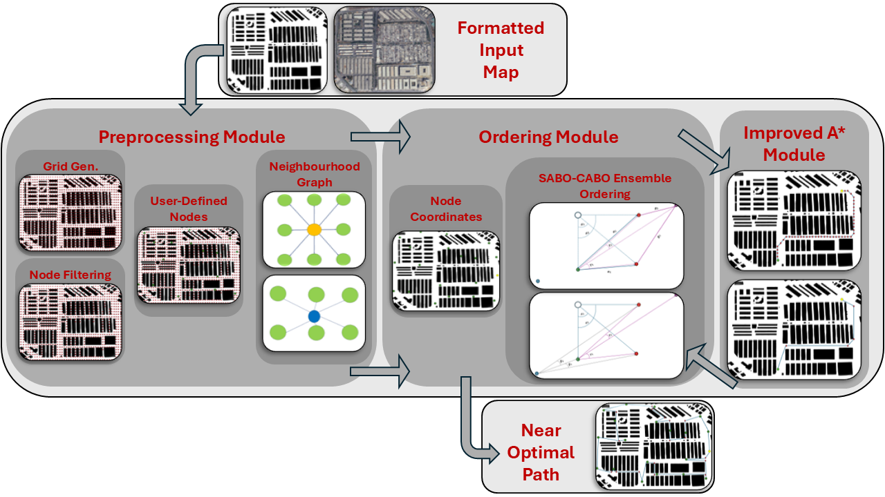
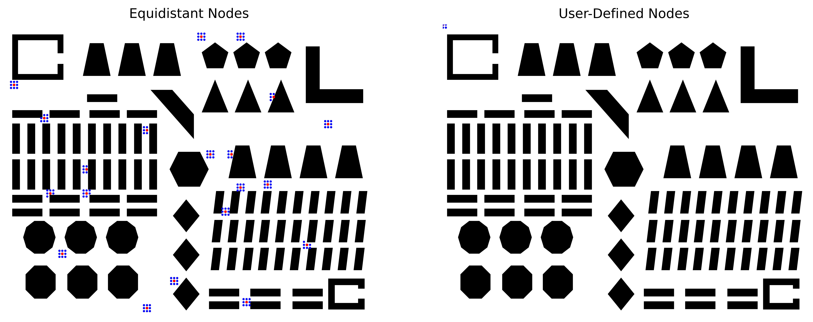
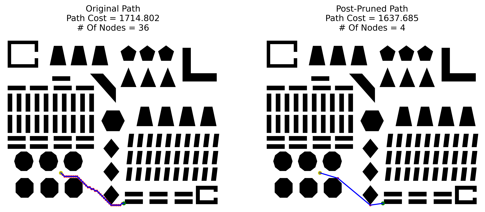

# Angle-Based Multi-Goal Ordering And Path-Planning Using An Improved A* Algorithm (AMuGOPIA)

## Overview

The repository for Angle-Based Multi-Goal Ordering And Path-Planning Using An Improved A* Algorithm (AMuGOPIA). A scientific journal paper submitted to Robotics and Autonomous Systems in the fields of Path-Planning, Multi-Goal Pathfinding, A-Star Search Algorithm, Robotic Navigation and Autonomous Mobile Robots.

- **Authors:** [Abdullah Allus](https://scholar.google.com/citations?user=rDlVCVUAAAAJ&hl=en), [Mustafa Unel](https://scholar.google.com/citations?hl=en&user=h4lFct0AAAAJ&view_op=list_works).
- **Maintainer:** [Abdullah Allus](https://github.com/abdullah1aloush1).

## Abstract

In the field of autonomous mobile robotics, the demand for highly efficient path-planning algorithms is crucial. Among the various path-planning tasks and challenges, multi-goal path planning stands out as a particularly complex problem, where the objective is to determine the most efficient path for a robot to visit multiple goal nodes. In this paper, we introduce a novel ordering algorithm designed to optimize the sequence in which the goal nodes are visited. The ordering is based on a one-distance-two-angles ordering paradigm, which reduces the dependency on distances as deciding factors and incorporates more angles to gather the necessary information, thereby reducing the computational complexity of the overall ordering procedure. The backbone of the algorithm is an improved version of the A* search algorithm that we developed to further reduce the distance cost of the original A* algorithm by solving some internal issues caused by the nature of the algorithm when dealing with grid-based environments. Extensive experiments were conducted to demonstrate the computational efficiency and cost-effectiveness of our proposed algorithm. The scalability and reproducibility of the proposed ordering algorithm and the improved A* were validated by testing them on various publicly available maps in numerous different scenarios. We also performed comprehensive comparisons with existing state-of-the-art algorithms to evaluate the performance. The conducted experiments report that our proposed algorithm consistently outperformed other algorithms in numerous scenarios, underscoring its reliability and potential to match or exceed the performance of current state-of-the-art methods in the domain of multi-goal path planning. The Python code, map and other resources of our proposed algorithms are available at https://github.com/abdullah1aloush1/AMuGOPIA.

## AMuGOPIA's Methodology

AMuGOPIA is a set of several algorithms integrated together. The integrated framework takes a top-view 2D image map file of an autonomous mobile robot's workspace as input. The input map should contain only black and white coloured areas, where white coloured areas represent navigable passages for the robot, while black areas represent blocked passages that the robot can not navigate through (obstacles).

AMuGOPIA works mainly on finding a near-optimal visiting configuration (order) to visit the provided goal nodes. Then, it connects the ordered goal nodes by navigable path sections providing sampled path coordinates along the whole path.

The framework finally outputs a list of the coordinates for the overall path and plots it as a figure.

### Work Flow:

- Pre-Processing Module  
The framework processes the input map of the workspace. This process involves generating grid equidistant nodes, defining neighbourhood relations to form an efficient neighbourhood graph, establishing cost definitions, and detecting obstacles. This structured foundation is crucial for the effectiveness of the subsequent modules.

- Ordering Module  
This module uses the novel ordering algorithm utilising geometrical information obtained by the introduced angles and the one-distance-two-angle paradigm to dynamically order the goal nodes to minimize overall cost and time complexity taking local and global information into account.

- Improved A* Module  
This module utilises the improved version of the A* algorithm used to find the shortest path between two nodes. The improvements include integrating the pre-processed map, ensuring obstacle avoidance, managing cost considerations, and post-pruning the generated path. These modifications optimize the A* algorithm for its application in the ordering algorithm.

## Getting Started

__**Working Instructions with AMuGOPIA**__

**AMuGOPIA** can be set up and used in your own projects with the following steps:

__Prerequisites:__

    Python 3.x

__Initial Assignments:__

- 1- Open the file AMuGOPIA.ipynb and go to the cell titled "**Uploading The Map and Setting User Choices**".
- 2- Insert the name of your own PROCESSED map with its corresponding extension (preferably .png) in the corresponding Variable:

        imageDirectory = 'map.png'

- 2.1- If your own map file is not located in the same folder of AMuGOPIA.ipynb, write its directory before the name of the map.
- 2.2- If you do not have a map, use the already provided map file (map.png).
- 3- Assign the desired spacing value in terms of pixels to the corresponding Variable (Follow the conditions of this parameter detailed in the paper):

        spacing = 40 #pixels

- 4- Assign the desired scale value in terms of meters/pixels to the corresponding variable:

        scale = 1 #meters/pixels

- 5- In the cell titled "Map Pre-Processing", you can assign the coordinates of the nodes that will be worked on during the execution of AMuGOPIA to the corresponding variable as a list of tuples, each tuple includes the x and y coordinates of one of the user-defined nodes:

        userDefinedNodesCoordinates = [(300, 300), (400, 1255), (4314, 154), (646, 3678), (2100, 2325), (2710, 106), (1266, 164), (4000, 3660), (2800, 1775), (2475, 3277), (4200, 1500)]# list of user-defined goal nodes to visit

- 5.1- if the scale is 1 meters/pixel, then you can insert the coordinates in terms of meters. However, if the scale is not 1 meters/pixel you should calculate the corresponding pixel coordinates of your nodes.
- 6- Investigate the following cells and run them to assess the algorithms. You can always assign the starting node coordinates to the corresponding variable. The starting node should be either present in the generated equally-spaced nodes or stored in the variable 'userDefinedNodes':

        startingNode = (300, 300)

- 7- You can also assign the coordinates of the goal nodes as a list of tuples to the corresponding variable. The goal nodes should be either present in the generated equally-spaced nodes or stored in the variable 'userDefinedNodes':

        goalNodes = [(5266, 1255), (4314, 154), (646, 3678), (2100, 2325), (2710, 106), (1266, 164), (5000, 3660), (3222, 1775), (2475, 3277), (988, 1972)]

- Note: in the provided file, all starting nodes and goal nodes are selected randomly from the available navigable nodes. You can manually select the coordinates of those node if you follow steps 6 and 7 in the experiment of interest.

__Running AMuGOPIA:__

- 0- After assigning and checking for the necessary preliminaries, RUN the code.

- 1- At first, AMuGOPIA will generate equidistant nodes using the specified spacing and then will show the generated equidistant nodes and the user-defined nodes on the map plot.

- 2- Second, AMuGOPIA will show the Non-navigable nodes representing the obstacles.

- 3- Third, AMuGOPIA will detect the contours of the obstacles and show them.

- 4- Fourth, AMuGOPIA demonstrates two figures, one for equidistant nodes and the other for user-defined nodes, showing some randomly picked nodes and their neighbours.

- 5- Fifth, AMuGOPIA shows the visual results of a comparison between the classical A* algorithm and the improved A* algorithm on randomly picked starting and goal nodes.

- 6- Sixth, AMuGOPIA demonstrates a comparison between A*, Improved A*, Bidirectional A* and RRT*.

- 7- Seventh, AMuGOPIA visualizes a comparison between Sequential Angle-Based and Combined Angle-Based Ordering.

- 8- Eighth, AMuGOPIA shows a comparison between Ensemble Angle-Based Ordering and Post-Pruned Ensemble Angle-Based Ordering.

- 9- Ninth- AMuGOPIA demonstrates an example of Optimal Ordering Using Google's TSP Solver.

- 10- Last, AMuGOPIA visualizes a comparison between various ordering algorithm.

 

